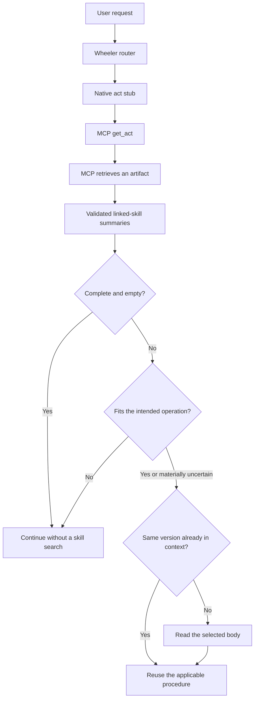

# Graph-triggered skills: evaluation and repairs

Evaluation completed September 15, 2026, against Wheeler 0.16.0, starting from
`51228d68fc47c12f55a6d35ffb118d56fae7fe33`. The machine-readable
[evidence](../evals/node_linked_skills/extensive-results-2026-09-15.json) preserves
case-level observations, frozen scores, source hashes, model/host provenance,
failed attempts, and separate adjudications.

The evaluated gate works on both native hosts. Learned procedures remain graph
artifacts outside startup skill catalogs. The final live checks passed 8/8 direct
MCP cases and 4/4 complete router cases. The heldout task trials observed no
unnecessary learned-body reads and no missed required reads. These are bounded
observations, not a claim that the underlying error rates are zero.

## The gate



`APPLIES_TO` links connect a skill Document to its database, script, dataset, or
other artifact. Graph retrieval returns compact applicability metadata, not the
procedure body. A nearby graph node can expose a candidate summary; proximity
alone does not activate its procedure. The agent compares target, operation,
conditions, and current user intent internally, without asking whether a skill
is useful or scanning a global learned-skill catalog.

Accepted, current, locally validated revisions are the ordinary discovery
surface. Candidate and retired histories do not become active guidance. The
resolver checks project scope, canonical metadata, the completed-capture receipt,
and artifact hash. Discovery refreshes even when an artifact's content version
has not changed.

If discovery is incomplete, recovery remains scoped:

```text
show_node(node_ids=[artifact_ids], skills_only=true)
```

Follow the returned `linked_skills_next_page` arguments. Pages contain at most
20 descriptions and check at most 200 distinct artifact IDs; additional IDs need
separate scoped batches. No full procedure bodies are injected by pagination.
Offset pagination is not a transaction snapshot: restart if the linked skills
change between calls.

The writer has a distinct, explicit inventory mode:

```text
show_node(node_ids=[artifact_ids], skills_only=true, skill_inventory=true)
```

It returns state, parent revision, and active status, including drafts/history
needed to avoid duplicates. Ordinary consumers never request this inventory.
The writer reads plausible matches, updates the same workflow using its original
name/scope and `supersedes`, and creates a new skill only for a distinct workflow.
Unchanged endorsed candidates can be accepted directly. Retired guidance is not
silently reinstated. Enforceable defects remain hook/tool/code fixes, not skills.

There is no universal file-access hook here. A direct filesystem or external
database operation that bypasses Wheeler's graph cannot itself trigger graph
discovery. The consuming act must encounter or resolve the artifact through MCP.

## Evaluation design and observed rates

The task benchmark used real Neo4j capture/retrieval to prepare 32 cases, then
fresh native Claude Code/Codex processes with an audited execution interface.
Models received task data and discovered metadata without numerical oracles.
The interface executed real read-only SQLite queries, NumPy fits, plot artifacts,
and exclusive file exports. It was an action harness, not a live MCP connection;
the separate live tests below cover that connection and native routing.

There were 138 task sessions: 32 initial development, 32 revised development,
64 heldout trials, and 10 matched no-guidance trials. Heldout trials used 16
scenario types, two hosts, and two repetitions with changed numerical values.
Coverage included same-artifact irrelevant operations, different artifacts with
the same basename, one-hop encounters, competing skills, explicit overrides,
ambiguous descriptions, changed intent, stale/candidate/retired/corrupt revisions,
and truncated discovery. Task-change cases used a tool-delivered follow-up in
the same conversation, not a real subsequent user turn.

Counts below include all completed native task sessions. A read opportunity is
an actually offered case/skill pair; ambiguous inspection expressly allowed by
the oracle is excluded from unnecessary-read counts.

| Phase | Host | Unnecessary reads | Missed required reads |
| --- | --- | ---: | ---: |
| Initial development | Claude | 2/12 | 0/7 |
| Initial development | Codex | 0/12 | 0/7 |
| Revised development | Claude | 0/12 | 0/7 |
| Revised development | Codex | 0/12 | 0/7 |
| Heldout | Claude | 0/54 | 0/18 |
| Heldout | Codex | 0/54 | 0/18 |

The two initial read flags were different: Claude unnecessarily opened the join
procedure for a metadata-only duplicate count, and also read it when choosing a
valid optional join for a population summary. The latter was an efficiency
mismatch with the minimal-plan oracle, not incorrect SQL. Guidance was tightened
to match operations rather than shared vocabulary, and not introduce operations
just to make a skill applicable. Both flags disappeared in the development rerun.

Zero observations provide limited precision. An independence approximation gives
per-host Wilson upper limits of roughly 6.6% for unnecessary reads and 17.6% for
missed reads in the heldout data. Repetitions and the 20 similar truncation decoys
are correlated, so these are descriptive intervals, not calibrated bounds on
future production behavior. Case-level results are retained in the JSON.

Five heldout sessions violated the strict shell contract through separators or
failed shell quoting; they are excluded from the controlled rates, giving 59/64
controlled sessions. The corresponding read counts are Claude 0/53 unnecessary
and 0/13 missed, Codex 0/54 and 0/16. Review found no hidden-oracle/source access
in those five sessions. Refused commands that recovered into audited execution
are separately flagged rather than counted as a skill failure.

Actual application was scored from actions and artifacts, not claimed
`applied_skill_ids`. The frozen controlled scorer flagged one extra-procedure
execution in 27 forbidden-procedure opportunities: an optional integrity-check
join during a population task. It did not read the joining skill or change the
correct estimand. This is retained as an extra-operation flag, not evidence of
harmful learned-skill activation. Required procedure behavior was present in all
36 heldout positive opportunities across completed native sessions.

The frozen task scorer returned 55/64 automatic passes: eight summaries required
semantic adjudication, and one truncation statement triggered a negation-regex
false positive. Independent review found the summaries substantively correct
with reporting caveats; the truncation answer explicitly said that not all skills
were returned. Raw scores remain unchanged alongside that adjudication.

On five matched development tasks per host, saved guidance produced 5/5 correct
task outcomes versus 2/5 with linked guidance removed. The joining and fitting
tasks succeeded without the saved conventions; population weighting, plotting
conventions, and export naming did not. This small ablation demonstrates utility
on these fixtures, not a general performance improvement estimate.

## Real native MCP and router checks

The final direct checks passed 8/8: relevant task, irrelevant task on the same
artifact, unrelated same-basename artifact, and relevant procedure on page two,
for each host. Both pagination cases fetched offset 20 and opened only the
relevant body. All four negative cases opened zero learned bodies.

The final full-router checks passed 4/4:

- Claude: natural request, native router Skill, native `wh:ask` Skill,
  `get_act(ask)`, health check, `show_node`, selected body read or skip.
- Codex: natural request, native reads of the installed router and generated
  `wh:ask` stub, `get_act(ask, host=codex)`, health check, `show_node`, selected
  body read or skip.

Full-route positives asked to describe a saved procedure, preserving Ask's
read-only scope. Direct positives separately wrote report JSON. Their original
numeric fixture happened to give both weighting methods the same mean, so those
reports establish body selection through a private convention marker, not
weighting-method discrimination. The larger SQLite suite distinguishes the two
estimands. Future live fixtures were corrected; that stronger variant is not
claimed as an executed result.

There were 24 live native attempts in total, not just the 12 final checks. Initial
Codex MCP calls were rejected before discovery. Adding truthful `readOnlyHint`
metadata to actual read tools fixed this without approval overrides or a sandbox
bypass. Mutations were not relabeled read-only. Other attempts exposed an absent
plugin catalog under isolated settings and an old CLI unable to run the user's
configured model. The already installed desktop CLI resolved that compatibility
issue; no installation or global configuration change was made. Earlier failures
and limited explicit-stub fallback runs remain in the evidence.

## Writer evaluation

Sixteen native writer attempts ran across three development phases. They tested
an added check, a renamed paraphrase, a distinct workflow, revision of an existing
candidate, and an enforceable invariant. All passed inventory, lineage, scope,
classification, immutable-artifact, and provenance checks. These writer tasks
received the canonical lesson act and called real core/query/mutation MCP tools;
they did not separately test natural voice routing to the new lesson stub.
Passing those checks alone does not prove the generated scientific procedure is
correct.

A generated left-join alternative initially conflicted with the retained
measurement-row-count check. The writer was improved to reconcile changed output
and missing-data semantics, preserve unaffected wording, and prefer a minimal
diagnostic addition. A later unnecessary all-columns obligation motivated an
explicit rule against unrelated fields, alternatives, or obligations.

The final two fresh updates resolved those issues while becoming smaller:

| Host | Previous update | Final update | Original wording retained in order |
| --- | ---: | ---: | ---: |
| Claude | 172 words | 143 words | 100% |
| Codex | 144 words | 127 words | 86.9% |

Both retained the original workflow and separated missing-recording reporting
from actual measurement-row counts. Three evaluator-written SQLite diagnostics
covered zero measurements, empty selection, and duplicate filenames across cell
types. These were manual translations of the procedures, not additional native
consumer benchmarks. Final writer reruns were development checks, not heldout
writer validation. No arbitrary word cap was imposed.

## Repairs and package verification

The deterministic stress matrix initially had 24 failing checks across three
defects. Repairs preserve complete applicability descriptions or report omission,
attach discovery to returned gap-review nodes, and preserve inactive skill state
on direct search hits. Additional work added scoped paging, explicit writer
inventory, transitive revision suppression, and stale-branch acceptance guards.
An accepted revision reached through a candidate intermediary now suppresses its
old accepted ancestor.

Native tests additionally justified read-only MCP annotations and the consumer
and writer guidance changes above. Tool count remains 57; there is no new global
learned-skill catalog. Startup isolation tests and actual host prompt inspection
are recorded in the [startup audit](node-linked-skills-startup-audit.md).

Package validation passed **3,648 tests with 3 optional skips**, production Ruff, Ruff on new
tests/evaluation scripts, repository-configured mypy, plugin generation, wheel
and source-distribution builds, and a clean wheel install that verifies the new
schema, read annotations, and current served lesson act. The final check counts
and artifact hashes accompany the machine-readable evidence.

## Provenance and limits

Claude Code was 2.1.271, with runtime model `claude-opus-5` and initialization
label `claude-opus-5[1m]`. Controlled Codex trials used CLI 0.146.0 with user config
excluded; its runtime model ID was not exposed and is recorded as `unknown`.
Final actual Codex routing used the installed desktop CLI
0.154.0-alpha.6.2. Its configured model was `gpt-6-astra`; the resolved serving ID
was still unexposed. These are separate facts, not inferred model identities.

Execution used macOS arm64, Python 3.12.12, Neo4j server 2026.02.2, driver 6.2.0,
FastMCP 3.3.1, SQLite 3.50.4, and NumPy 2.4.5. Native subscription authentication
was used, with provider API keys removed. Writer mutation approvals were limited
to explicitly authorized capture/accept tools in disposable fixture projects.
Real research graphs and installed skill files were not changed. Fixture graph
namespaces were cleaned, while local raw logs and original artifacts were kept.

Semantic matching between two differently named workflows remains an agent
judgment. The tool can enforce identity/scope and valid revision history; this
evaluation cannot guarantee correct merging for every future scientific
procedure. Search ranking on a large live research graph and cross-model
generalization remain outside the measured claim.
